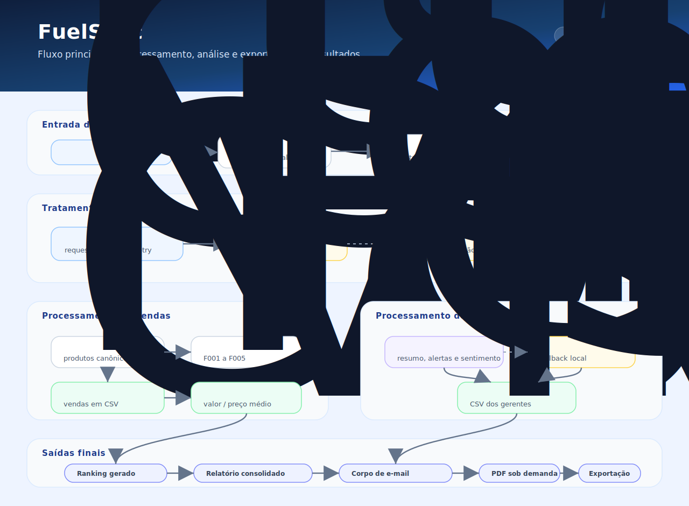
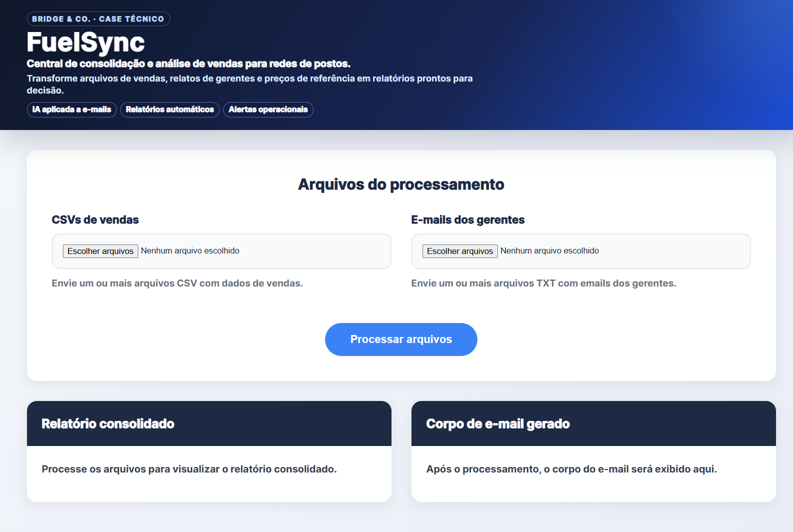
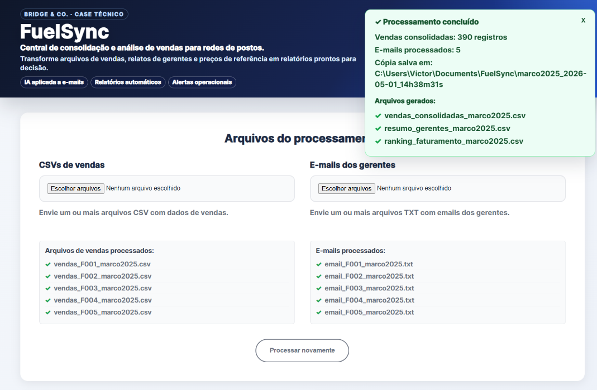
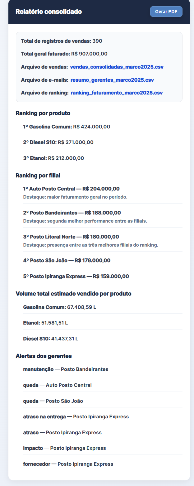
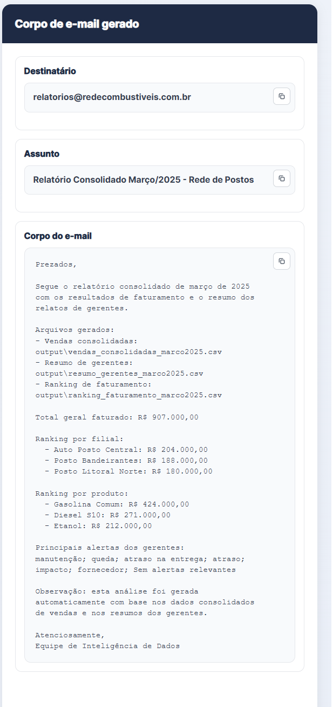
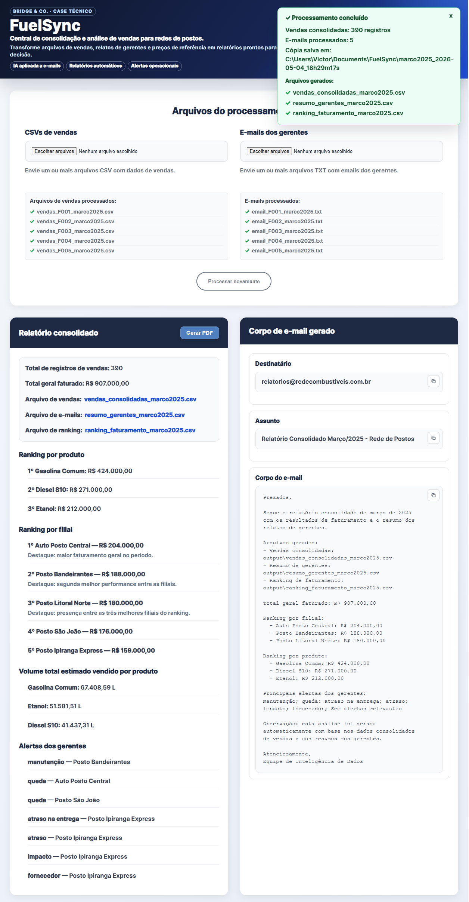

# FuelSync

Aplicação web em Python/Flask para consolidação e análise de vendas de redes de postos de combustível, desenvolvida para o case técnico da Bridge & Co.

O FuelSync transforma arquivos CSV de vendas, relatos em TXT dos gerentes e preços de referência em arquivos consolidados, rankings, resumo operacional, corpo de e-mail sugerido e PDF sob demanda.

## Contexto do case

A solução automatiza uma rotina de análise da sede de uma rede fictícia de postos. O fluxo recebe arquivos enviados por filiais, normaliza dados inconsistentes, consulta preços médios de referência e gera entregáveis prontos para revisão.

## Funcionalidades

- Upload de arquivos CSV de vendas.
- Upload de arquivos TXT com e-mails/relatos dos gerentes.
- Identificação determinística da filial pelo nome do arquivo.
- Normalização determinística dos produtos vendidos.
- Coleta automática de preços de referência via web.
- Cache interno dos últimos preços válidos por até 24 horas.
- Fallback padrão do case quando a URL falha e não há cache válido.
- Cálculo de volume estimado em litros.
- Consolidação das vendas em CSV.
- Uso da Gemini API apenas para resumir textos narrativos dos gerentes.
- Fallback local para resumo de e-mails quando a IA falha ou atinge limite de cota.
- Geração de ranking por filial e por produto.
- Geração de corpo de e-mail sugerido para envio à sede, com valores no padrão brasileiro e rankings quebrados por linha.
- Geração de PDF sob demanda.
- Exportação local dos arquivos finais em pasta datada.

## Tecnologias utilizadas

- Python
- Flask
- pandas
- requests
- BeautifulSoup
- Gemini API
- python-dotenv
- ReportLab
- HTML/CSS/JavaScript

## Fluxo da aplicação

O diagrama abaixo resume o fluxo principal do FuelSync, desde o envio dos arquivos até a geração dos resultados finais.



1. O usuário envia CSVs de vendas e TXTs de e-mails pela interface web.
2. A aplicação salva os arquivos enviados nas pastas de entrada.
3. As filiais são identificadas pelo padrão dos nomes dos arquivos.
4. Os produtos são normalizados para os nomes canônicos do case.
5. Os preços médios são coletados da URL oficial do case.
6. Se a URL falhar, o sistema tenta usar cache interno recente; se não houver cache válido, usa fallback padrão.
7. As vendas são consolidadas e o volume estimado é calculado.
8. Os e-mails são resumidos com Gemini API ou fallback local.
9. O ranking de faturamento é gerado.
10. A interface exibe relatório consolidado, corpo de e-mail e botão para gerar PDF sob demanda.
11. Os CSVs são exportados para uma pasta local datada em `Documents/FuelSync/`.
12. Ao clicar em `Gerar PDF`, o PDF é criado/atualizado em `output/` e copiado para a mesma pasta da execução atual.

## Coleta e cache de preços

A aplicação sempre tenta consultar primeiro a URL oficial:

```text
https://bridgenoc.github.io/case-postos/precos_marco2025.html
```

A prioridade é:

```text
web -> cache recente -> fallback padrão do case
```

O cache interno fica em:

```text
app/cache/precos_referencia_marco2025.json
```

Regras do cache:

- `app/cache/` é ignorado pelo Git.
- Se a URL responder, os preços da web são usados e o cache é atualizado/substituído.
- Se a URL falhar, a aplicação tenta usar o cache local.
- O cache só é aceito se estiver íntegro, contiver os três produtos obrigatórios e tiver até 24 horas.
- Se a URL falhar e não houver cache válido, a aplicação usa o fallback padrão do case.

Fallback padrão:

```python
{
    "Gasolina Comum": 6.29,
    "Etanol": 4.11,
    "Diesel S10": 6.54,
}
```

## Entradas esperadas

Arquivos de vendas:

```text
vendas_F001_marco2025.csv
vendas_F002_marco2025.csv
...
vendas_F005_marco2025.csv
```

Arquivos de e-mails:

```text
email_F001_marco2025.txt
email_F002_marco2025.txt
...
email_F005_marco2025.txt
```

O código `F001`, `F002`, etc. é extraído do nome do arquivo e resolvido por um mapa fixo de filiais.

## Normalização de produtos

| Produto canônico | Variações aceitas |
|---|---|
| Gasolina Comum | Gasolina Comum, Gas. Comum, Gasolina Comun, Gasolina, Gasolina C, GC |
| Etanol | Etanol, Etanol Hidratado, Etanol Hid., Etanol Comum |
| Diesel S10 | Diesel S10, Diesel S-10, Diesel S10 Aditivado, DSL S10, S10 |

Produtos desconhecidos geram erro claro. A IA não é usada para normalizar produtos.

## Uso de IA

A Gemini API é usada somente para:

- resumir e-mails dos gerentes;
- identificar destaques;
- identificar alertas;
- classificar sentimento geral.

A chave é carregada por variável de ambiente:

```text
GEMINI_API_KEY=sua_chave_aqui
```

O arquivo `.env` não deve ser versionado. Ele está incluído no `.gitignore`.

A IA não é usada para identificar filial, normalizar produtos, calcular valores, decidir preços ou definir mês/pasta.

## Arquivos de execução em output/

`output/` é a pasta local de execução da aplicação e é ignorada pelo Git.

Ao iniciar a aplicação, `output/` é limpo dos arquivos finais antigos.

Após processar os arquivos, `output/` contém:

```text
output/vendas_consolidadas_marco2025.csv
output/resumo_gerentes_marco2025.csv
output/ranking_faturamento_marco2025.csv
```

Após clicar em `Gerar PDF`, `output/` também contém:

```text
output/relatorio_consolidado_marco2025.pdf
```

O PDF não é gerado automaticamente durante o processamento. Ele é criado sob demanda pelo botão `Gerar PDF`.

## Exportação local em Documents/FuelSync/

Ao clicar em `Processar arquivos`, a aplicação cria uma pasta local datada:

```text
Documents/FuelSync/marco2025_YYYY-MM-DD_HHhMMmSSs/
```

Exemplo:

```text
Documents/FuelSync/marco2025_2026-05-01_12h36m38s/
```

Após o processamento, essa pasta recebe:

```text
vendas_consolidadas_marco2025.csv
resumo_gerentes_marco2025.csv
ranking_faturamento_marco2025.csv
```

Ao clicar em `Gerar PDF`:

- o PDF é gerado/atualizado em `output/relatorio_consolidado_marco2025.pdf`;
- o mesmo PDF é copiado para a mesma pasta da execução atual em `Documents/FuelSync/`.

## Exemplos versionados

A pasta abaixo contém os arquivos de entrada do case, reunindo CSVs de vendas e TXTs de e-mails dos gerentes:

```text
emails-vendas/
```

A pasta abaixo contém exemplos finais versionados no GitHub:

```text
docs/resultados/marco2025/
```

Ela é diferente de:

- `output/`, que contém arquivos locais gerados durante a execução;
- `app/cache/`, que contém cache interno de preços.

## Colunas principais

`vendas_consolidadas_marco2025.csv`:

- `data`
- `filial_id`
- `filial_nome`
- `produto_canonico`
- `valor_total_brl`
- `preco_medio_litro_brl`
- `volume_estimado_litros`

`resumo_gerentes_marco2025.csv`:

- `filial_id`
- `filial_nome`
- `resumo`
- `destaques`
- `alertas`
- `sentimento_geral`

## Interface da aplicação

Tela inicial para envio dos arquivos CSV de vendas e TXT dos gerentes.



Processamento concluído com CSVs gerados e cópia local salva em Documents/FuelSync.



Relatório consolidado com faturamento, rankings, volume estimado e alertas por filial.



Corpo de e-mail gerado automaticamente para apoio ao envio para a sede.



Visão geral da aplicação após o processamento completo dos arquivos.



## Estrutura do projeto

- `app/` - aplicação Flask.
- `app/routes.py` - rotas e orquestração do fluxo web.
- `app/services/` - processamento de vendas, e-mails, preços e relatórios.
- `app/utils/` - normalização, filiais e utilitários de arquivos.
- `app/cache/` - cache interno de preços, ignorado pelo Git.
- `app/templates/` - templates HTML.
- `app/static/` - estilos CSS.
- `emails-vendas/` - arquivos de exemplo do case para entrada, com vendas e e-mails.
- `vendas/` - arquivos CSV de entrada.
- `emails/` - arquivos TXT de entrada.
- `output/` - arquivos gerados localmente, ignorados pelo Git.
- `docs/resultados/marco2025/` - exemplos versionados de saída.
- `tests/` - testes automatizados.

## Como executar

No PowerShell:

```powershell
python -m venv .venv
.\.venv\Scripts\Activate.ps1
pip install -r requirements.txt
python run.py
```

Acesse:

```text
http://127.0.0.1:5000
```

## Configuração do .env

Crie um arquivo `.env` na raiz do projeto:

```text
GEMINI_API_KEY=sua_chave_aqui
```

Não coloque a chave real no repositório.

## Tratamento de erros

O FuelSync trata:

- ausência de arquivos;
- extensão inválida;
- CSV com colunas obrigatórias ausentes;
- produto desconhecido;
- filial fora do padrão esperado;
- falha temporária na URL de preços;
- cache de preços ausente, inválido ou vencido;
- falha ou limite da Gemini API;
- tentativa de gerar PDF antes do processamento.

## Decisões técnicas

- Flask foi escolhido por simplicidade e agilidade para o protótipo web.
- pandas centraliza manipulação tabular e geração dos CSVs.
- requests e BeautifulSoup fazem a coleta automática dos preços.
- Regras determinísticas cuidam de filiais, produtos, preços e cálculos.
- IA é aplicada apenas onde há texto narrativo e ambiguidade humana.
- CSVs permanecem como entregáveis principais do case.
- PDF é uma entrega complementar sob demanda.
- A exportação local em `Documents/FuelSync/` facilita a apresentação dos arquivos finais.

## Limitações conhecidas

- Não há autenticação de usuários.
- Não há banco de dados relacional.
- O upload sobrescreve arquivos com mesmo nome nas pastas de entrada.
- O mês e os nomes dos arquivos estão direcionados ao recorte março/2025 do case.
- O fallback local da IA é heurístico e mais simples que a análise da Gemini.
- O sistema gera corpo de e-mail sugerido, mas não envia e-mail automaticamente.

## Próximos passos

- ampliar testes automatizados;
- permitir download direto dos arquivos gerados;
- enriquecer o PDF com mais detalhes do relatório visual;
- adicionar gráficos e filtros;
- preparar deploy em ambiente web.

## Autor

Desenvolvido por Victor-Suander.
