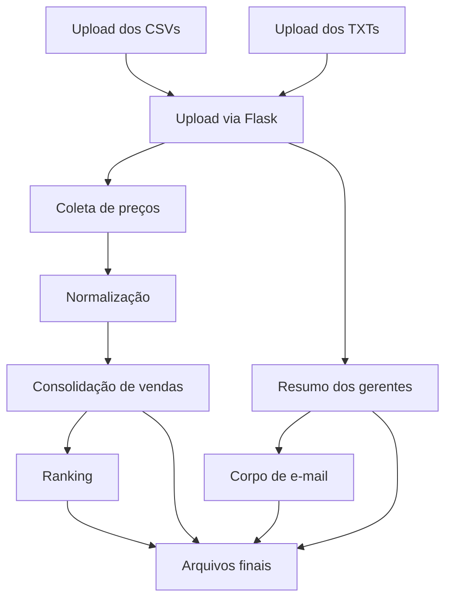

# Gas Pulse

Aplicação web em Python/Flask que automatiza a consolidação de vendas de postos de combustível, resumo de emails de gerentes e relatórios consolidados para a Bridge & Co.

## Contexto do case

Desenvolvido para um case técnico da Bridge & Co., o Gas Pulse reúne dados de vendas, mensagens de gestores e preços de referência em um fluxo de processamento automatizado. O objetivo é transformar dados dispersos em relatórios prontos para a sede.

## Problema resolvido

- Produtos com nomes inconsistentes entre filiais dificultam a consolidação.
- Consolidar vendas manualmente em planilhas é trabalhoso e sujeito a erros.
- E-mails dos gerentes não têm resumo estruturado para análise rápida.
- É necessário comparar faturamento, volume estimado e alertas em um único relatório.

## Funcionalidades

- Upload de arquivos CSV de vendas.
- Upload de arquivos TXT de e-mails dos gerentes.
- Normalização de produtos inconsistentes entre filiais.
- Coleta automática de preços de referência via web.
- Cálculo de volume estimado com base em preço médio.
- Consolidação de vendas em um único arquivo CSV.
- Resumo estruturado dos e-mails dos gerentes.
- Fallback local quando a IA falha ou atinge limite de cota.
- Ranking de faturamento por filial.
- Ranking de faturamento por produto.
- Geração de corpo de e-mail profissional para a sede.
- Geração de arquivos finais em `output/`.

## Tecnologias utilizadas

- Python
- Flask
- pandas
- requests
- BeautifulSoup
- Gemini API
- python-dotenv
- HTML/CSS
- Git/GitHub

## Arquitetura da solução

O fluxo de dados do Gas Pulse é organizado da seguinte forma:

- CSV de vendas + TXT de e-mails
- Upload via interface Flask
- Serviços de processamento em `app/services/`
- Normalização de produtos em `app/utils/`
- Coleta automática de preços via web
- Consolidação de vendas e cálculo de volume estimado
- Resumo dos e-mails por gerente
- Geração de ranking e corpo de e-mail
- Exportação de arquivos finais para `output/`

## Diagrama de fluxo



## Estrutura de pastas

- `app/` - código da aplicação Flask.
- `app/services/` - lógica de processamento de vendas, emails, preços e relatórios.
- `app/utils/` - utilitários de normalização e filiais.
- `app/templates/` - templates HTML do Flask.
- `app/static/` - CSS e recursos estáticos.
- `vendas/` - arquivos CSV de entrada de vendas.
- `emails/` - arquivos TXT de entrada dos gerentes.
- `output/` - arquivos gerados pela aplicação.
- `docs/` - documentação do projeto.
- `tests/` - testes automatizados.

## Arquivos de entrada

O projeto usa arquivos nomeados por filial, com código de identificação:

- `vendas_F001_marco2025.csv` até `vendas_F005_marco2025.csv`
- `email_F001_marco2025.txt` até `email_F005_marco2025.txt`

O código `F001`, `F002`, etc. identifica cada filial no processamento.

## Arquivos de saída

- `output/vendas_consolidadas_marco2025.csv`
- `output/resumo_gerentes_marco2025.csv`
- `output/ranking_faturamento_marco2025.csv`

## Normalização de produtos

| Produto canônico | Variações mapeadas |
|---|---|
| Gasolina Comum | Gasolina Comum, Gas. Comum, Gasolina Comun, Gasolina, Gasolina C, GC |
| Etanol | Etanol, Etanol Hidratado, Etanol Hid., Etanol Comum |
| Diesel S10 | Diesel S10, Diesel S-10, Diesel S10 Aditivado, DSL S10, S10 |

## Relação lógica dos dados

| Entrada | Código de filial | Filial | Uso no fluxo |
|---|---|---|---|
| `vendas_F001_marco2025.csv` | F001 | Posto Bandeirantes | Vendas consolidadas e ranking |
| `email_F001_marco2025.txt` | F001 | Posto Bandeirantes | Resumo dos gerentes e alertas |
| `produto_canonico` | — | — | Relaciona o produto ao preço médio e ao cálculo de volume |
| `filial_id` + `produto_canonico` | — | — | Base para consolidação e ranking |

## Uso de IA

- A Gemini API é usada para resumir e-mails dos gerentes.
- A chave `GEMINI_API_KEY` é carregada a partir de `.env`.
- O arquivo `.env` não deve ser versionado.
- Há fallback local para gerar resumos quando a IA falha ou é limitada por cota.
- A IA não é usada para identificar filiais.
- A IA não é usada para normalizar produtos.

## Tratamento de erros

O projeto trata as seguintes situações:

- arquivo ausente ou pasta de entrada vazia
- extensão inválida do arquivo enviado
- CSV com colunas obrigatórias faltando
- produto desconhecido na normalização
- filial inválida no nome do arquivo
- falha ao acessar a URL de preços de referência
- falha ou limite da API de IA Gemini

## Como executar

No PowerShell:

```powershell
python -m venv .venv
.\.venv\Scripts\Activate.ps1
pip install -r requirements.txt
python run.py
```

Acesse:

```
http://127.0.0.1:5000
```

## Configuração do .env

Crie um arquivo `.env` na raiz com:

```text
GEMINI_API_KEY=sua_chave_aqui
```

Não coloque a chave real no repositório.

## Prints da aplicação


## Decisões técnicas

- Flask foi escolhido por simplicidade e agilidade para um protótipo web.
- pandas é usado para manipulação e consolidação de dados tabulares.
- requests e BeautifulSoup suportam a coleta automática de preços de referência.
- Regras determinísticas definem a normalização de produtos e filiais.
- A IA é usada apenas para textos narrativos de e-mails.
- O output em CSV garante compatibilidade com análise e revisão manual.
- Fallback local oferece resiliência contra limites de cota da IA.

## Limitações conhecidas

- Não há banco de dados relacional.
- Não há autenticação ou controle de usuários.
- Não há dashboard visual avançado.
- Depende da URL de preços de referência para coleta automática.
- A IA pode ser limitada por cota da Gemini API.

## Próximos passos

- adicionar testes automatizados para serviços e normalização
- criar dashboard com gráficos e filtros
- permitir download direto dos arquivos gerados
- integrar um banco de dados para persistência
- aprimorar a análise e os resumos dos e-mails
- criar pipeline de deploy contínuo

## Autor

Desenvolvido por Victor-Suander.
